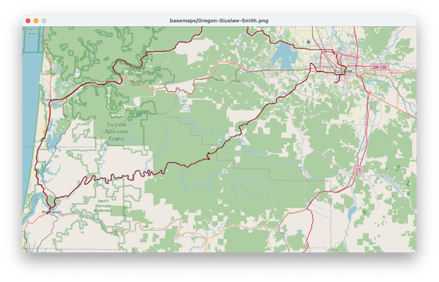
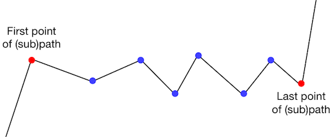
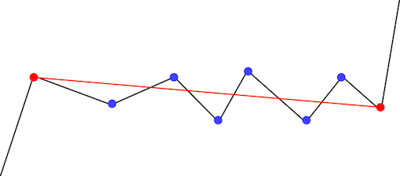
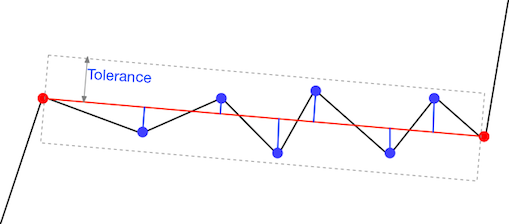
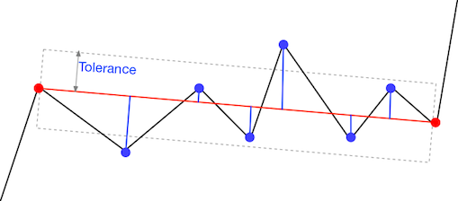
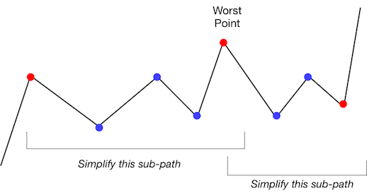
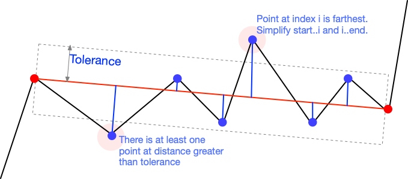
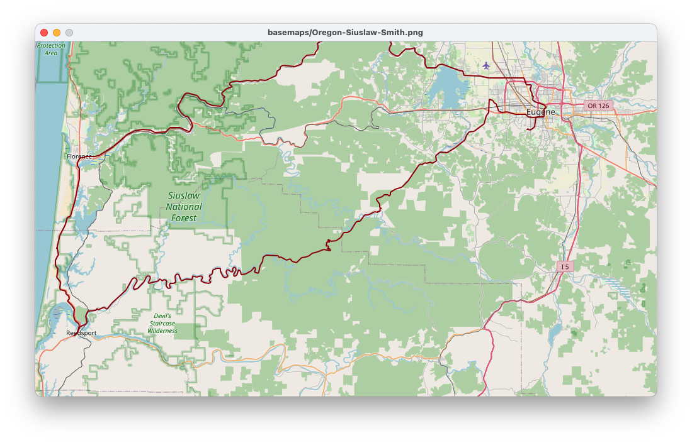

# HOWTO simplify geographic paths

When you zoom out on a map, your map display application (Google 
maps, Apple maps, ESRI ArcGIS, etc) does not draw the rivers, roads, 
and borders in the same level of detail as when you are zoomed far 
in.  How does your application simplify those paths? 

There is a path simplification approach that is almost universal in 
geographic information systems, and also applicable to simplifying 
other complex paths such as hand-written characters. 
It is known as Douglas-Peucker, or sometimes 
[Ramer-Douglas-Peucker](
https://en.wikipedia.org/wiki/Ramer%E2%80%93Douglas%E2%80%93Peucker_algorithm),
after its originators. In robotics, where it is used to extract 
lines from robot range-finder data, it is known as split-and-marge.
We will refer to it simply as _summarize_. 



For example, the red path above is plotted from just 353 points,
selected using the _summarize_ algorithm 
from 14,392 samples taken by a GPS sample on a long 
bicycle ride.  

## Recursive summary

Suppose we start with a long list of points from some sampling 
device such as a GPS recorder or a pen moving on a tablet computer. 
We will call that list of points a _path_. 
We want to keep a small number of "important" points and discard the 
rest, forming a new summary path that is very close to the 
original.  The basic idea of the _summarize_ algorithm is to 
recursively divide the original path at its most important point.  
A point is considered _important_ if it is far from an imaginary 
line between the start and end of the path under consideration. 

Suppose we want to summarize the subpath between two points in the 
path.



We might first ask, "is a straight line from the first to the last 
point a good enough summary?"    



We will accept this as "good enough" if none of the points between 
is too far from the straight line.  We measure each distance and 
compare to a  pre-determined _tolerance_.  



If all the points are within the tolerance, then we will keep just 
those end-points and discard the points between.  However, we may 
find some points are too far from the straight line.  



In this case, we will identify the point that is _farthest_ from the 
straight line.  We will subdivide at that point. 



When we subdivide at point _p_, we must recursively summarize the 
subpath from the first point to _p_, then from _p_ to the last point.
The summary for the original subpath is the concatenation of the 
summaries for the two small subpaths, representing _p_ just once 
where they join. 

## Working start to end

Descriptions of the _summarize_ algorithm, like
[this one in Wikipedia](
https://en.wikipedia.org/wiki/Ramer%E2%80%93Douglas%E2%80%93Peucker_algorithm
), describe it abstractly as concatenating subpaths.  We split the 
path at its most important point, summarize both halves, and then
joint them at that point.  That's a nice way to understand the 
algorithm, but it isn't quite how we want to implement it. 

Concatenation of lists is an expensive operation in Python. 
Although we can do it in one line of Python code, Python actually 
executes a loop to copy all the elements of each part into a new 
list. It would be nicer if we could avoid that.  And we can, if we 
are careful. 

If we work from start to end, always summarizing the subpath before 
a division point before summarizing the supath after the division 
point, we can append each "important" point into a single list in 
order.  Consider this initial list of points, and suppose we set a 
tolerance of 0.25 units. 


Initially we note that the start point must be included in the summary,
and add it.  Then we check for deviations from an imaginary line 
from the first point (index 0, point 0,0) to the last (index 6, 
point 4,4).  


We note that point 4, (2,4) is farthest from the imaginary line.
We don't add it to the summary yet, but we make two recursive calls
to summarize points 0..4 and points 4..6. We must make the calls
_in that order_ because we want the "important" points from the first
subpath to be added to the summary before the "important" points 
from the second subpath.  Even though we know that point 4, (2,4) 
will eventually be added to the summary, we want to wait until any
important points before between point 0 and point 4 are added. 

In the recursive call to summarize points 0..4, 
we again imagine a line from the beginning straight to the end of 
that subpath, and this time we find that point 2, (2,2) is farthest 
from the line.  Once again we will subdivide at that point,
but we won't add (2,2) to the summary yet. 


When we make the recursive call to summarize points
0..2, we find that no point between point 0 (0,0)
and point 2 (2,2) deviates enough from the line to
require further division.  This is the base case of
our recursive summarization.  Finally we add the
end point of this subpath to the summary. 


Similarly, the call to summarize points 2..4 finds no points that 
deviate significantly from the straight line.  We add
point 4, (2,4) to the summary. 


The final recursive call (made from the very first split) likewise 
finds no significant deviations in points between point 4 and point 
6.  It adds (4,4) to the summary and returns. 


When all the recursive calls have returned, they have built the 
summary list in the desired order.  It contains the important points 
and omits the points that were on or very close to lines between the 
important points. 

## Building blocks

I have provided several useful building blocks for you: 

- Module `map_view` displays a basemap and allows you to plot
paths in UTM coordinates.  This basemap has been designed to'
fit the points in `data/SmithRiverLp.csv`. 

- Module `geometry` provides the distance calculations you'll need 
  to determine how far each point is from a line. 

- The data in `data/SmithRiverLp.csv` is a CSV file in
UTM coordinates.  It was extracted and converted
from `data/Smith_River_300k_pre-ride_2022.gpx`, which was
produced by a GPS navigation and recording device. You could plot 
all 14,392 points, but it would be excruciatingly slow with our 
Python graphics. We can summarize it in a couple seconds
  (or a little more, if we plot while we summarize). 

- The configuration file `config.ini` includes paths to the data and 
  basemap image files, as well as several constants to "register" 
  the data to the map.  "Registration" of an image means determining 
  the correspondence between pixel coordinates and geographic 
  coordinates.  You may notice that this configuration file isn't 
  as simple as others we have used, because map registration 
  involves some calculations involving two landmarks in the map.

## Getting started

Create a file `summarize.py`.  We will start it in the usual way, 
importing the building blocks we will need. 

```python
"""Summarize a path in a map, using the standard Ramer-Douglas-Peucher (aka Duda-Hart)
split-and-merge algorithm.
Author: Your name here
Credits: TBD
"""

import csv
import doctest

import geometry
import map_view
import config
```

For this project, I am going to suggest one additional Python 
library, `logging`.  Logging is a bit like adding print statements 
to help debug a program, but much more flexible. In addition to 
important it, we will initially configure it in "DEBUG" mode, the 
most verbose option. 

```python
import logging
logging.basicConfig()
log = logging.getLogger(__name__)
log.setLevel(logging.DEBUG)
```
We can quiet it down later by changing the level to
`logging.INFO` or `logging.WARN`.  Initially I anticipate you will 
have a good deal of use for debugging information. 

We will end the file in the usual way: 

```python
def main():
    pass

if __name__ == "__main__":
    doctest.testmod()
    print("Tested")
    main()
```

We might as make sure our base map displays nicely: 

```python
def main():
    map_view.init()
    map_view.wait_to_close()
```

Note that all the information about the map view, including a path 
to the image file as well as its registration to a coordinate system,
is in config.ini.  

## Get the data

Write a function to read the CSV file into a list of (easting, 
northing) tuples.  Because we will be using these points extensively 
for distance calculations, interpret the easting and northing entries  
as floating point numbers (type `float`) 
instead of integers.

```python
def read_points(path: str) -> list[tuple[float, float]]:
```

We will call that function from the main program, using a path to 
the data file from the configuration file: 

```python
    points = read_points(config.UTM_CSV)
```
I suggest reading the data file before initializing the map view, 
but that is up to you. 

It is now possible to plot these points, but I warn you that it will be 
painfully slow.  Perhaps you should do it now just so that you will 
appreciate how much faster it is to summarize the path and plot the 
summary.  Do this after initializing the `map_view` and after 
reading the points, but before closing the `map_view`. 

```python
    for point in points:
        map_view.plot_to(point)
```

You will have time to make a nice cup of coffee while the plot 
slowly inches across the screen. You might also hear the fan on your 
computer rev up as the pathetic Python graphics library  struggles to 
handle 14,391 line segments. I 
think you'll want to comment those lines out if you
have suffered through it once. 

## Checkpoint

At this point you have a functioning, but very very slow program for 
mapping GPS data in UTM format.  Your program has the following 
functions: 

- main
- read_points

## Simplify! 

Less is more, or something like that. For sure less points is faster.
It is time to get to the heart of this project, which is the 
summarization function.  It's header will be: 

```python
def summarize(points: list[tuple[float, float]],
              tolerance: int = config.TOLERANCE_METERS,
              ) -> list[tuple[float, float]]:
```

Note that we can give an explicit tolerance, but if we omit the 
tolerance argument, our function will take a default value from the 
configuration file.  The higher the tolerance, the fewer the points 
needed to summarize a path.  In the configuration file I have set 
the tolerance to 100 meters, i.e., our summarized path should 
deviate from the original path by no more than 100 meters.  You 
might want to experiment with higher and lower settings to see how 
they affect the size of the summary and the speed of plotting. 

The option for giving an explicit tolerance in the call makes it 
easier for us to write a simple test case.  We can use the example 
above: 

```python
     >>> path = [(0,0), (1,1), (2,2), (2,3), (2,4), (3,4), (4,4)]
     >>> expect = [(0,0), (2,2), (2,4), (4,4)]
     >>> simple = summarize(path, tolerance=0.5)
     >>> simple == expect
     True
```

I'm cheating a little by using integers rather than floating point 
numbers for points in the test case. I found it more cluttered and 
harder to read when I added ".0" to each number, and I know Python 
will do the right thing when it mixes integers and floating point 
numbers.

We will set up both the summary list of points and the tolerance in 
`summarize`.  As we have before, we will use the square of distance 
rather than distance, to avoid taking a square root unnecessarily, 
so we will also calculate the square of tolerance to check distances 
against. 

```python
    summary: list[tuple[float, float]] = [points[0]]
    epsilon = float(tolerance * tolerance)

    def simplify(start: int, end: int):
        """Add necessary points in (start, end] to summary."""
        return

    simplify(0, len(points)-1)
    return summary
```

Notice that we place the first point into the summary before we call 
`simplify`, initially on the whole span from first to last point.  
At this point our program should run, but the test case will fail 
because our `simplify` function doesn't do anything. 

You can call `summarize` this way in your main function: 

```python
    print(f"{len(points)} raw points")
    summary = summarize(points, config.TOLERANCE_METERS)
    print(f"{len(summary)} points in summary")
```

## The heart of the heart of the matter

`simplify` is where the magic happens.  Like any recursive function, 
we want to break it down into base cases and recursive cases.  Our 
cases will depend on an imaginary line between `points[start]` and 
`points[end]`, but we don't have to do anything to actually create 
that line.

- Base case:  There are _no_ points on the line between `points[start]`
and `points[end]` that whose distance is greater than our tolerance. 
For this case, we can just add `points[end]` to the summary. 

- Recursive case:  There is at least one point between
`points[start]` and `points[end]` whose distance from a line directly
between `points[start]` and `points[end]` is greater than `tolerance`.
Let `p` be the point between start and end that is farthest from 
  that line.  Then we recursively call `simplify` on the points from 
  `start` to `p`, and on the points from `p` to `end`.  

And that's it!  Except turning that into Python takes several 
lines of code.   

You can use `geometry.deviation_sq` to determine 
how far each point is from an imaginary line.  You can find the 
point with maximum deviation in the same loop that you use to 
determine whether _any_ point has a squared difference greater than 
the square of tolerance. 



Also, since we are producing the summary points in order from first 
to last, we can plot them as we go.  I suggest the following: 

- At the beginning of `simplify`, call
  `map_view.scratch(points[start], points[end])` to show the imaginary
   line (at least if `end - start > 2`).  
- Each time you add a point to `summary`, also call
  `map_view.plot_to(point)` to show that point on the summarized path.
- In `main`, or just before you return from `summarize`, also call
  `map_view.clean_scratches()` to clear out all those imaginary lines
   and give you a nicer view of the summarized path. 

And remember that `log` object?  There is a very good chance that 
you will want to add some log messages, like print statements in 
your code.  For example, in my sample solution, I placed the 
following debugging messages at the beginning of `simplify`: 

```python
        log.debug(f"Simplifying from {start}: {points[start]} to {end}: {points[end]}, {points[start+1:end]}")
        log.debug(f"Summary so far: {summary}")
```

This was useful to me for debugging with the test case.  When the 
code was working satisfactorily, I changed the logging level to
`logging.INFO`.  I didn't have to remove or comment out the `log.
debug` lines; I just deactivated them.  

## Checkpoint

At the end, in addition to `read_points` and your `main` function, 
you will have a `summarize` function, and within `summarize` your 
recursive `simplify` function.  When you run your program, if you 
leave the tolerance at 100 meters, it should produce a summary of 
just 353 points and a plot that looks like this: 




